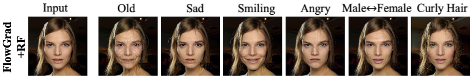
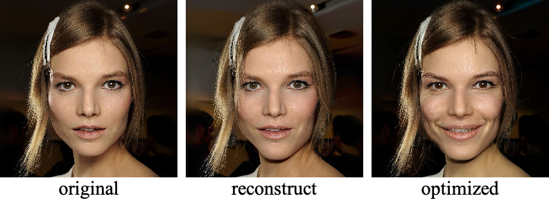

# FlowGrad

This is the official implementation of the CVPR2023 paper
## [FlowGrad: Controlling the Output of Generative ODEs With Gradients](https://openaccess.thecvf.com/content/CVPR2023/html/Liu_FlowGrad_Controlling_the_Output_of_Generative_ODEs_With_Gradients_CVPR_2023_paper.html) 
by *Xingchao Liu, Lemeng Wu, Shujian Zhang, Chengyue Gong, Wei Ping, Qiang Liu* from NVIDIA and UT Austin



## Interactive Colab notebook

We provide an introductory Colab notebook on a toy 2D example to help users understand the method. Play [here](https://colab.research.google.com/drive/1rx3-WbC6yyx1jnES3xVQ0b463xfihFJU?usp=sharing).

## Controlling Rectified Flow on CelebA-HQ

We provide the scripts for applying FlowGrad to control the output of pre-trained Rectified Flow model on CelebA-HQ.
First, clone and enter the repo with,

```
git clone https://github.com/gnobitab/FlowGrad.git
cd FlowGrad
```

The pre-trained generative model can be downloaded from [Rectified Flow CelebA-HQ](https://drive.google.com/file/d/1ryhuJGz75S35GEdWDLiq4XFrsbwPdHnF/view?usp=sharing) 
Just put it in ``` ./ ```

### Dependencies
The following packages are required,

```
torch, numpy, lpips, clip, ml_collections, absl-py 
```

### Run
In our example, we use the demo image ```demo/celeba.jpg``` and text prompt ```A photo of a smiling face.``` The following command can be used to do this editing.

```
python -u main.py --config RectifiedFlow/configs/celeba_hq_pytorch_rf_gaussian.py --text_prompt 'A photo of a smiling face.' --alpha 0.7 --model_path ./checkpoint_10.pth --image_path demo/celeba.jpg
```

The  images will be saved in ```output/figs/```. The folder includes,

* ```original.png```: the original image.

* ```reconstruct.png```: the image generated from the encoded latent of the original image by running the ODE in the reverse direction. There is subtle difference from the orignal image due to the discretization error.

* ```optimized.png```: the image generated after editing with FlowGrad.



## Citation
If you use the code or our work is related to yours, please cite us:
```
@InProceedings{Liu_2023_CVPR,
    author    = {Liu, Xingchao and Wu, Lemeng and Zhang, Shujian and Gong, Chengyue and Ping, Wei and Liu, Qiang},
    title     = {FlowGrad: Controlling the Output of Generative ODEs With Gradients},
    booktitle = {Proceedings of the IEEE/CVF Conference on Computer Vision and Pattern Recognition (CVPR)},
    month     = {June},
    year      = {2023},
    pages     = {24335-24344}
}
```
